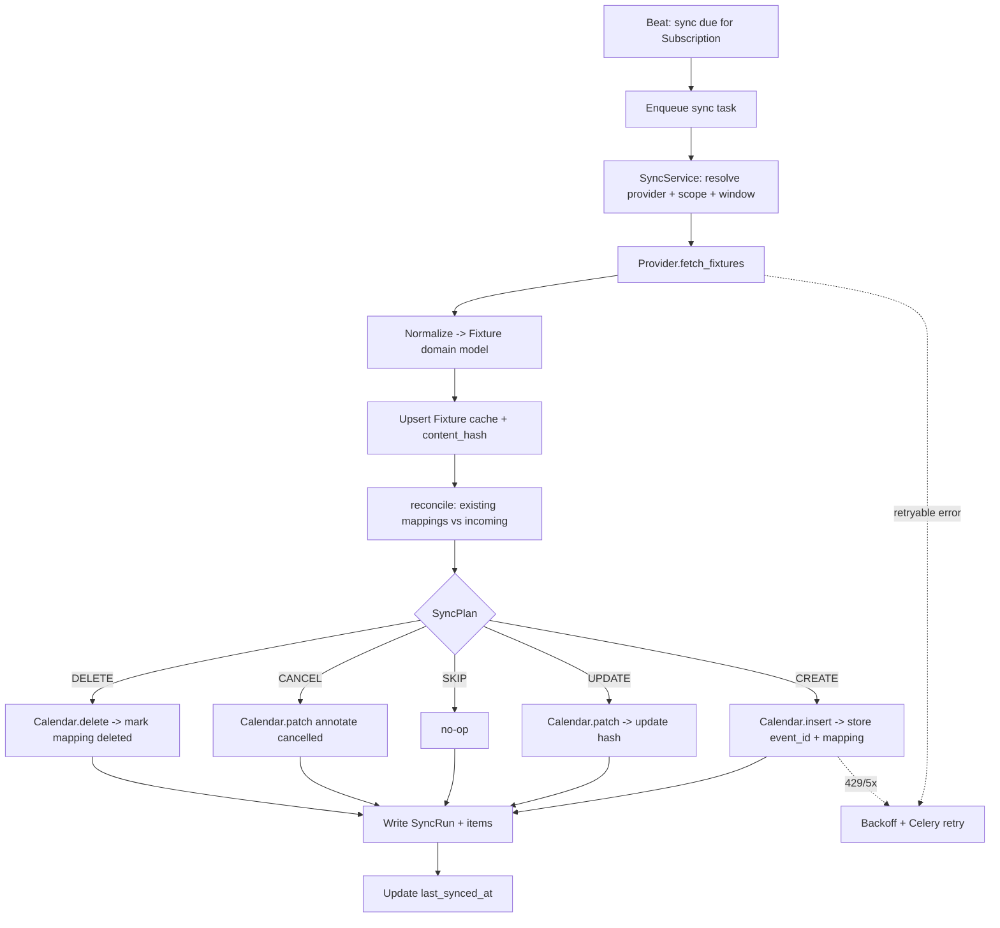
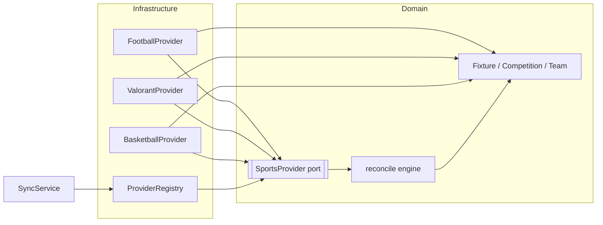
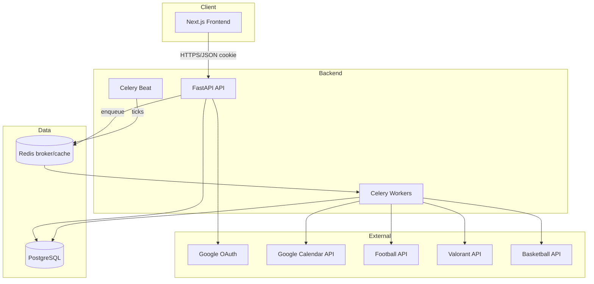
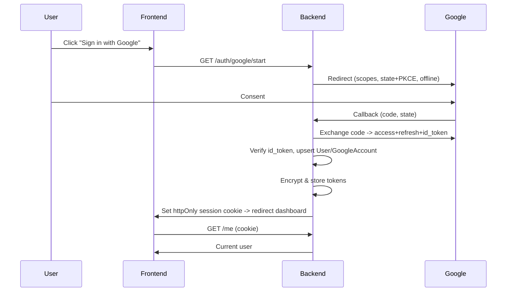
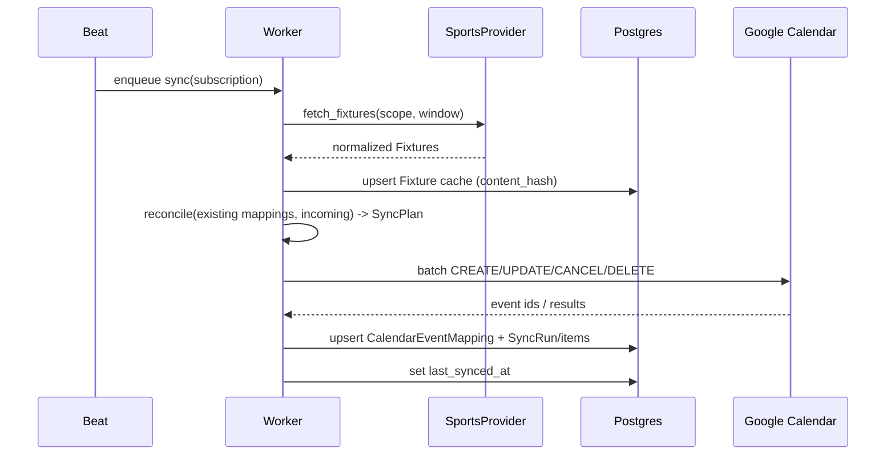
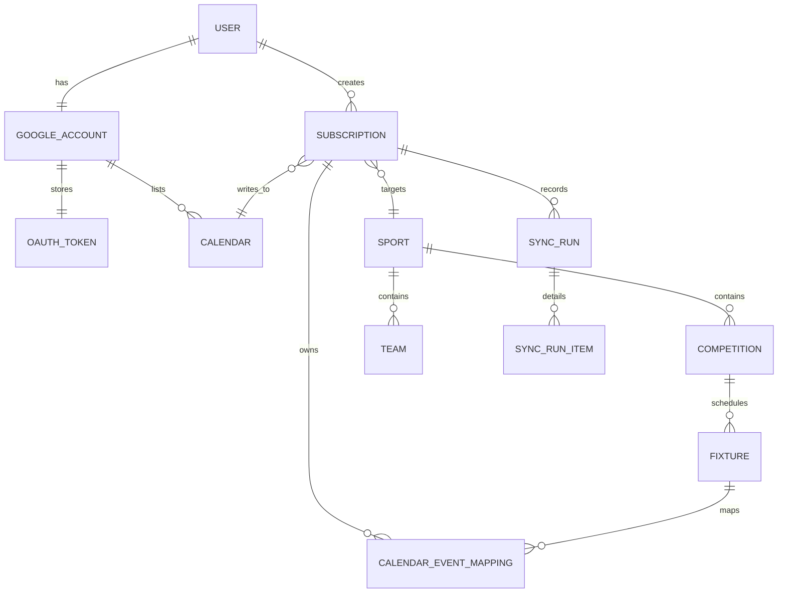
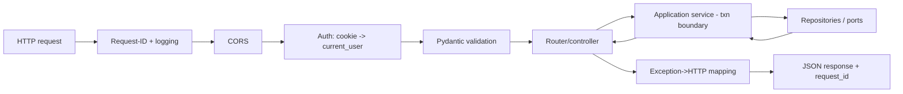
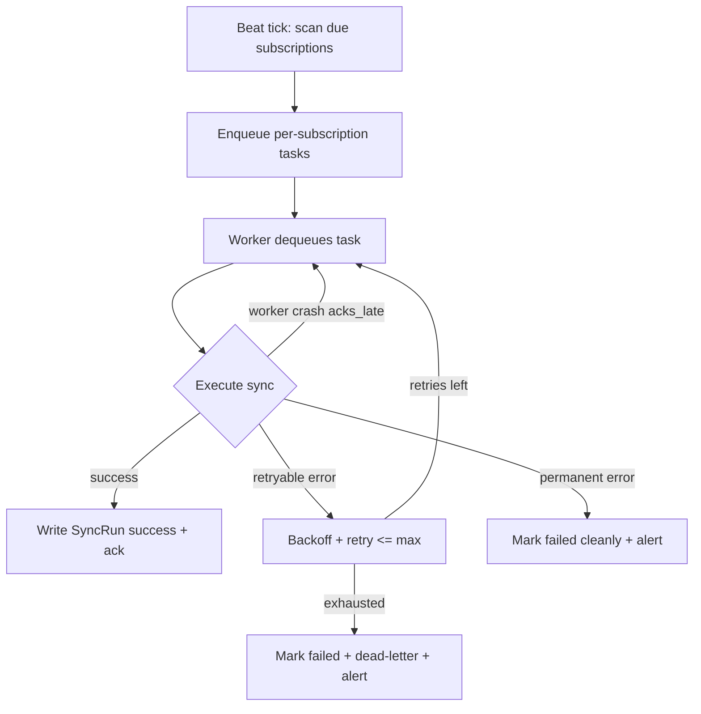
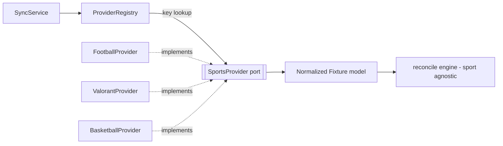

# MatchSync — Software Architecture Document (SAD)

**Status:** Blueprint / Stage 0 (Architecture)
**Audience:** Engineering team building all subsequent stages
**Scope:** This document defines the target architecture. It is intentionally prescriptive so that implementation stages require no further architectural decisions. Where a decision is genuinely deferrable, it is marked **[Deferred]** with the trigger condition that forces the decision.

---

## 0. Reading Guide & Guiding Principles

Before the detailed sections, five principles govern every decision that follows. When a later section seems to conflict with one of these, the principle wins.

1. **The synchronization engine must never know what a "sport" is.** It operates on a normalized `Fixture` model. Everything sport-specific lives behind a provider interface (Section 7). This single constraint drives most of the design.
2. **Idempotency over cleverness.** Every sync operation must be safe to run twice. We derive stable identity keys rather than trusting external IDs or wall-clock timing. This is what makes "prevent duplicates" and "periodic sync without user interaction" tractable.
3. **Modular monolith first, extract later.** We optimize for a small team shipping fast, while drawing module boundaries strict enough that a future service extraction is mechanical, not a rewrite (Section 2).
4. **Tokens and secrets are radioactive.** OAuth refresh tokens are the crown jewels: encrypted at rest, never logged, never sent to the frontend (Sections 8, 9, 13).
5. **Design for the sync you can't see.** The product's value is created by background jobs the user never watches. Observability, retries, and history (Sections 10, 14, 15) are first-class features, not afterthoughts.

---

## 1. High-Level Architecture

MatchSync is a **web application with an asynchronous synchronization backend**. There are three runtime planes:

- **Interactive plane** — the user-facing request/response path (Next.js → FastAPI → Postgres). Low latency, human-initiated.
- **Background plane** — scheduled and queued workers that pull sports data, reconcile it, and push to Google Calendar. No human in the loop. This is where the product's core value is produced.
- **Data plane** — PostgreSQL as the system of record, plus Redis as broker/cache.

### Components

| Component | Technology | Responsibility |
|---|---|---|
| **Frontend** | Next.js (App Router), TypeScript, Tailwind, shadcn/ui, TanStack Query, Zustand | Auth UI, onboarding, subscription management, sync history views. Talks only to our own API. |
| **Backend API** | FastAPI, SQLAlchemy 2.0, Pydantic v2 | REST API, OAuth orchestration, subscription CRUD, serves history/status. Enqueues jobs; does *not* perform long syncs inline. |
| **Background Workers** | Celery workers | Execute the sync pipeline: fetch → normalize → reconcile → push to Google. |
| **Scheduler** | Celery Beat | Emits periodic "sync due" ticks and provider-refresh ticks. |
| **Database** | PostgreSQL | System of record for users, tokens (encrypted), subscriptions, fixtures cache, calendar-event mapping, sync history. |
| **Broker / Cache** | Redis | Celery broker + result backend, rate-limit counters, short-lived caches, distributed locks. |
| **Google APIs** | OAuth 2.0, Google Calendar API | Identity + calendar read/write. |
| **Sports APIs** | Per-sport external providers (football, Valorant, basketball) behind our provider abstraction | Source of fixtures. |
| **External Services** | Secrets manager, error tracking (Sentry), metrics/logs sink | Cross-cutting infra. |

### Communication

```
Browser ──HTTPS/JSON──► FastAPI ──SQLAlchemy──► PostgreSQL
   ▲                        │
   │ TanStack Query polls   ├──enqueue──► Redis (broker) ──► Celery Workers
   │                        │                                    │
   └────────────────────────┘                     ┌─────────────┼──────────────┐
                                                   ▼             ▼              ▼
                                            Sports APIs   Google Calendar   PostgreSQL
                                             (HTTPS)          (HTTPS)       (read/write)
Celery Beat ──periodic ticks──► Redis ──► Celery Workers
```

- **Frontend ↔ Backend:** HTTPS JSON REST. Auth via httpOnly session cookie (Section 9). The frontend never sees Google tokens.
- **Backend ↔ Workers:** The API *enqueues* Celery tasks over Redis; it never blocks on a sync. Workers write results to Postgres; the frontend observes progress by polling status/history endpoints (TanStack Query).
- **Workers ↔ External APIs:** Direct HTTPS. All external calls funnel through provider clients (sports) or the Google client wrapper, both of which enforce retries and rate limiting.
- **Everything ↔ Postgres:** Single system of record. Redis holds only ephemeral/derived state; losing Redis loses in-flight jobs and caches, never durable truth.

---

## 2. Architectural Style

**Recommendation: Modular Monolith** for the backend (single deployable FastAPI app + a worker process running the same codebase), with the frontend as a separate Next.js deployment.

### Options compared

| Style | Fit for MatchSync | Verdict |
|---|---|---|
| **Monolith (unstructured)** | Fastest to write, but no internal boundaries → provider logic and sync engine bleed into each other. Directly violates Principle 1. | ✗ Rejected — becomes unmaintainable exactly where we most need boundaries. |
| **Modular Monolith** | Single deployable, but code organized into modules (`identity`, `subscriptions`, `sync`, `providers`, `calendar`) with explicit interfaces and no cross-module DB reads. One team, one deploy pipeline, strong internal seams. | ✓ **Recommended.** |
| **Microservices** | Independent scaling and deploy per service. But: distributed transactions, network failure modes, service discovery, and 5× the ops burden — for a team that today has one user. Premature. | ✗ Rejected now; possible later. |

### Why modular monolith is correct *here*

- **Team size vs. system size.** The dominant cost early is developer velocity and correctness, not independent scaling. A monolith gives us transactional consistency (subscription change + calendar mapping in one DB transaction) for free.
- **The natural scaling axis is the worker, not the API.** As users grow, we scale *Celery workers horizontally* against the same codebase — no service split required (Section 16). Microservices would solve a problem we don't have while creating ones we can't yet afford.
- **The boundaries we actually need are internal, not network.** Principle 1 requires the sync engine to be isolated from providers. That is achieved with module boundaries + interfaces, not with separate deployables.

### Future migration path

Because modules communicate through **explicit service interfaces** (not by reaching into each other's tables), extraction is mechanical when a real trigger appears:

- **Trigger: a single sports provider needs independent scaling or a different language/runtime** → extract that provider into a service behind the same `SportsProvider` interface, called over HTTP/gRPC instead of in-process. The sync engine doesn't change.
- **Trigger: the sync worker fleet needs isolation (noisy-neighbor, separate SLA)** → it already runs as its own process; promote it to its own deployable + repo package. No code rewrite, just a build/deploy split.
- **Trigger: notifications become a product surface** (Discord/email/SMS, Section 17) → extract a `notifications` service consuming domain events.

We enable this now by (a) keeping modules dependency-directed (see Section 3), and (b) emitting **domain events** at key transitions (fixture synced, event created/updated/deleted) even in the monolith — initially consumed in-process, later over a message bus.

### Advantages / Disadvantages

- **Advantages:** single deploy, transactional integrity, easy local dev, low ops cost, refactor-friendly, boundaries enforced in code review not networking.
- **Disadvantages:** one codebase can accumulate coupling if discipline slips (mitigated by module import rules + CI lint on illegal cross-module imports); a single bad deploy affects everything (mitigated by health checks + fast rollback); can't scale API and, say, provider ingestion on totally independent tech. All acceptable at current and near-term scale.

---

## 3. Clean Architecture

We apply a layered/hexagonal architecture. **Dependencies point inward.** Domain and application layers know nothing about FastAPI, SQLAlchemy, Celery, Google, or any sports API.

```
        ┌────────────────────────────────────────────────┐
        │  Presentation (FastAPI routers, Celery tasks)  │  ← entrypoints
        ├────────────────────────────────────────────────┤
        │  Application (use-cases / services)            │  ← orchestration
        ├────────────────────────────────────────────────┤
        │  Domain (entities, value objects, interfaces)  │  ← business rules
        ├────────────────────────────────────────────────┤
        │  Infrastructure (Google client, providers,     │  ← implements domain
        │  Persistence: repositories, ORM models)         │     interfaces (ports)
        └────────────────────────────────────────────────┘
```

| Layer | Responsibility | May depend on | Must NOT depend on |
|---|---|---|---|
| **Presentation** | HTTP routing, request/response (de)serialization (Pydantic schemas), auth extraction, and the Celery task entrypoints. Thin — translates transport into application calls. | Application, Domain (types) | ORM models, provider SDKs |
| **Application (use-cases)** | Orchestrates a single business operation: "subscribe user to a competition", "run sync for subscription X". Owns transactions, calls repositories and ports. Contains *no* framework code. | Domain (entities + port interfaces) | FastAPI, SQLAlchemy, Celery, requests |
| **Domain** | Pure business rules: the `Fixture`, `CalendarEvent` mapping rules, identity/idempotency-key logic, reconciliation diff algorithm, and the **port interfaces** (`SportsProvider`, `CalendarGateway`, `TokenStore`, repositories). No I/O. | Nothing (stdlib + pydantic-core only) | Everything else |
| **Infrastructure** | Concrete adapters implementing domain ports: sports provider clients, Google Calendar gateway, token encryption, external HTTP. | Domain (to implement its interfaces) | Application, Presentation |
| **Persistence** | SQLAlchemy models, Alembic migrations, repository implementations mapping ORM ↔ domain entities. A specialized part of Infrastructure. | Domain | Application, Presentation |

**Why this matters for MatchSync specifically:** the reconciliation/diff logic and idempotency-key derivation are the heart of the product and the most bug-prone. Keeping them in a pure Domain layer means they are unit-testable with zero mocks and zero network — we can throw thousands of synthetic fixture-change scenarios at them cheaply.

---

## 4. Folder Structure

### Repository root

```
matchsync/
├── frontend/                # Next.js app (separate deployable)
├── backend/                 # FastAPI + Celery (single codebase, two processes)
├── docs/                    # This SAD + ADRs + runbooks
├── docker/                  # Dockerfiles, compose files, entrypoints
├── scripts/                 # dev bootstrap, seed data, one-off ops scripts
├── .github/                 # CI/CD workflows
└── README.md
```

**Decision — monorepo vs polyrepo:** Monorepo. One team, tightly-coupled contracts (API schema ↔ frontend types). A monorepo lets us share the OpenAPI-generated TS client and run atomic cross-cutting changes. Split later only if deploy/ownership diverge.

### Backend (`/backend`)

```
backend/
├── app/
│   ├── main.py                     # FastAPI app factory, router registration
│   ├── worker.py                   # Celery app factory, beat schedule
│   │
│   ├── api/                        # PRESENTATION (HTTP)
│   │   ├── v1/
│   │   │   ├── routers/            # "controllers": route → application service
│   │   │   └── deps.py             # FastAPI dependencies (current_user, db session)
│   │   └── middleware/             # request-id, auth, error-to-HTTP mapping, CORS
│   │
│   ├── tasks/                      # PRESENTATION (async entrypoints)
│   │   └── sync_tasks.py           # Celery tasks: thin wrappers calling app services
│   │
│   ├── application/                # APPLICATION (use-cases)
│   │   └── services/               # SyncService, SubscriptionService, AuthService...
│   │
│   ├── domain/                     # DOMAIN (pure)
│   │   ├── entities/               # Fixture, CalendarEventMapping, Subscription...
│   │   ├── value_objects/          # IdempotencyKey, FixtureStatus, TimeWindow
│   │   ├── ports/                  # Interfaces: SportsProvider, CalendarGateway,
│   │   │                           #   TokenStore, *Repository (protocols/ABCs)
│   │   └── sync/                    # reconcile(): diff engine (pure functions)
│   │
│   ├── infrastructure/             # INFRASTRUCTURE (adapters)
│   │   ├── providers/              # sports provider implementations + registry
│   │   │   ├── base.py             # SportsProvider ABC re-export, shared HTTP
│   │   │   ├── football/
│   │   │   ├── valorant/
│   │   │   └── basketball/
│   │   ├── google/                 # CalendarGateway impl, OAuth client, batching
│   │   ├── crypto/                 # token encryption (envelope/Fernet/KMS)
│   │   └── http/                   # shared resilient HTTP client (retry, backoff)
│   │
│   ├── persistence/                # PERSISTENCE
│   │   ├── models/                 # SQLAlchemy 2.0 ORM models
│   │   ├── repositories/           # Repository implementations (domain port impls)
│   │   └── session.py              # engine, session factory
│   │
│   ├── schemas/                    # Pydantic request/response DTOs (API contract)
│   ├── core/                       # config (settings), logging, security primitives
│   ├── exceptions/                 # domain + application exception hierarchy
│   └── utils/                      # pure helpers (time, ids) — no business logic
│
├── alembic/                        # migrations (versions/, env.py)
├── tests/
│   ├── unit/                       # domain + application (no I/O)
│   ├── integration/                # repositories, providers, google (with fakes/VCR)
│   └── e2e/                        # API + worker against ephemeral Postgres/Redis
└── pyproject.toml
```

**Directory purposes (backend):**

- **`api/v1/routers` (controllers):** Map HTTP to application services. No business logic, no DB queries. Version-namespaced from day one.
- **`api/middleware`:** Cross-cutting request concerns — request-id injection, auth cookie → user, mapping domain exceptions to HTTP responses, CORS.
- **`tasks`:** Celery entrypoints. Deliberately thin — they resolve a DB session, build the service, call one use-case method, and translate task retries. This keeps the same use-case usable from both HTTP and background contexts.
- **`application/services`:** Transaction boundary and orchestration. `SyncService.run_for_subscription(...)` fetches via a provider port, calls the domain diff engine, and persists results — all in one unit of work.
- **`domain/entities` & `value_objects`:** Framework-free business objects. `IdempotencyKey` (Section 6) and `FixtureStatus` live here.
- **`domain/ports`:** The interfaces (Python `Protocol`/ABC) that Infrastructure implements. This is the inversion that keeps the engine sport-agnostic.
- **`domain/sync`:** The pure `reconcile(existing_mappings, incoming_fixtures) -> SyncPlan` function. The most important 200 lines in the system.
- **`infrastructure/providers`:** One package per sport; each implements `SportsProvider`. A **registry** maps sport keys → provider instances (Section 7).
- **`infrastructure/google`:** Everything Google — OAuth token exchange/refresh, Calendar CRUD, batch requests, quota handling.
- **`infrastructure/crypto`:** Token encryption at rest.
- **`infrastructure/http`:** One shared resilient client (timeouts, retries, circuit-breaking) reused by all outbound calls.
- **`persistence/repositories`:** Implement domain repository ports; translate ORM rows ↔ domain entities so the domain never imports SQLAlchemy.
- **`schemas`:** Pydantic DTOs = the public API contract, feeding OpenAPI.
- **`core`:** Settings (env-driven), structured logging setup, security helpers.
- **`exceptions`:** A typed hierarchy (`DomainError`, `ProviderError`, `CalendarError`, `RetryableError`, `PermanentError`) so middleware and task-retry logic can branch on category, not string matching.
- **`utils`:** Genuinely pure helpers only — a graveyard for business logic if we're not careful, so kept minimal and reviewed.

### Frontend (`/frontend`)

```
frontend/
├── app/                            # App Router
│   ├── (marketing)/                # public landing
│   ├── (auth)/                     # sign-in, OAuth callback handling
│   ├── (dashboard)/                # protected app
│   │   ├── layout.tsx              # authenticated shell (nav, guards)
│   │   ├── subscriptions/          # choose sports/leagues/teams
│   │   ├── calendars/              # pick target calendar
│   │   └── history/                # sync history views
│   └── api/                        # route handlers (BFF: cookie<->session helpers)
├── components/
│   ├── ui/                         # shadcn/ui primitives
│   └── features/                   # composed, domain-aware components
├── lib/
│   ├── api/                        # generated OpenAPI client + typed fetchers
│   ├── query/                      # TanStack Query hooks, query keys, cache config
│   └── auth/                       # session helpers, guards
├── stores/                         # Zustand stores (ephemeral UI/client state)
├── hooks/                          # reusable React hooks
├── types/                          # shared TS types (some generated from OpenAPI)
└── styles/
```

**Directory purposes (frontend):**

- **`app/(groups)`:** Route groups separate marketing/auth/dashboard concerns and let the dashboard share a single guarded layout.
- **`app/api` (BFF):** Thin Backend-for-Frontend route handlers that hold the httpOnly session cookie and proxy/attach it — the browser JS never touches raw tokens.
- **`components/ui` vs `components/features`:** Primitives (buttons, dialogs) vs. domain widgets (SubscriptionPicker, SyncHistoryTable). Keeps shadcn upgrades isolated from product code.
- **`lib/api`:** The generated, type-safe client from our OpenAPI spec — the contract seam between the two repos-in-a-monorepo.
- **`lib/query`:** Centralized query keys + cache/staleness config so history/status polling is consistent.
- **`stores` (Zustand):** *Ephemeral client state only* (wizard step, UI toggles, optimistic selections). **Server state lives in TanStack Query, not Zustand** — this division is a hard rule (Section 12).

---

## 5. Database Design (Conceptual)

No SQL here — entities, relationships, and rationale only. Naming is conceptual.

### Core entities

**User**
- *Purpose:* the MatchSync account (identity within our system).
- *Key:* surrogate UUID `id`.
- *Important fields:* email, display name, created_at, status (active/suspended), timezone (default for event display).
- *Relationships:* 1—1 `GoogleAccount`; 1—* `Subscription`; 1—* `SyncRun`.
- *Scalability:* UUID keys avoid hotspotting and enable future sharding/merging; timezone stored per-user because calendar events are timezone-sensitive.

**GoogleAccount**
- *Purpose:* links a MatchSync user to their Google identity.
- *Key:* UUID `id`; unique on `google_subject` (the OAuth `sub`).
- *Fields:* google_subject, email, granted_scopes, connected_at.
- *Relationships:* 1—1 `User`; 1—1 `OAuthToken`; 1—* `Calendar`.
- *Scalability:* separating this from `User` allows future multiple-provider identities (Apple, Microsoft) without schema churn — each provider gets its own account row.

**OAuthToken**
- *Purpose:* stores encrypted Google access + refresh tokens.
- *Key:* UUID; FK to `GoogleAccount`.
- *Fields:* access_token (encrypted), refresh_token (encrypted), expiry, scopes, token_version, rotated_at.
- *Relationships:* 1—1 with `GoogleAccount`.
- *Scalability & security:* isolated table so encryption, access auditing, and rotation are contained; `token_version` supports key-rotation re-encryption. **Never** joined into read-heavy queries.

**Calendar**
- *Purpose:* a Google calendar available to the account, and which one is selected as the sync target.
- *Key:* UUID; unique on (`google_account_id`, `google_calendar_id`).
- *Fields:* google_calendar_id, summary, is_primary, is_sync_target, time_zone.
- *Relationships:* *—1 `GoogleAccount`; referenced by `Subscription` (which calendar this subscription writes to).
- *Scalability:* allowing subscriptions to target different calendars later ("Football → Sports calendar, Valorant → Esports calendar") is free with this shape.

**Sport**
- *Purpose:* top-level catalog entry (Football, Valorant, Basketball, …). Drives which provider handles it.
- *Key:* stable string `key` (e.g., `football`) as natural PK, plus surrogate UUID.
- *Fields:* key, display_name, provider_key, is_active, icon.
- *Relationships:* 1—* `Competition`, `Team`.
- *Scalability:* **Adding a sport = inserting a row + registering a provider (Section 7).** No schema change, no engine change. This is the core extensibility promise made concrete.

**Competition**
- *Purpose:* a league/tournament/event series (Premier League, VCT, NBA, an F1 season).
- *Key:* UUID; unique on (`sport_id`, `provider_competition_id`).
- *Fields:* sport_id, name, region/country, season, provider_competition_id, is_active.
- *Relationships:* *—1 `Sport`; 1—* `Fixture`; referenced by `Subscription`.
- *Scalability:* one polymorphic concept for "league/tournament/event" avoids per-sport tables — the provider maps its native concept onto `Competition`.

**Team**
- *Purpose:* a club, national team, or esports team (also stands in for an individual competitor like an F1 driver or tennis player).
- *Key:* UUID; unique on (`sport_id`, `provider_team_id`).
- *Fields:* sport_id, name, short_name, provider_team_id, competition affiliations (via join).
- *Relationships:* *—1 `Sport`; *—* `Competition` (join); referenced by `Subscription`; referenced by `Fixture` (home/away/participants).
- *Scalability:* modeling "participant" generically lets individual-athlete sports (tennis, F1) reuse the same entity — a driver is a `Team` of one. **[Deferred]** rename to `Participant` if athlete-vs-club distinction ever needs first-class fields.

**Subscription**
- *Purpose:* the user's expressed intent — "sync fixtures matching this filter into this calendar." The unit the sync engine operates on.
- *Key:* UUID.
- *Fields:* user_id, target_calendar_id, sport_id, scope_type (competition | team | all-in-sport), scope_ref_id, is_active, sync_frequency, last_synced_at, event_prefix/preferences.
- *Relationships:* *—1 `User`, `Sport`, `Calendar`; 0/1—* `Competition`/`Team` via scope; 1—* `CalendarEventMapping`; 1—* `SyncRun`.
- *Scalability:* a **polymorphic scope** (type + ref) keeps one table for all subscription granularities; `sync_frequency` per subscription enables tiered plans later.

**Fixture** (cache of external truth)
- *Purpose:* a normalized match/event pulled from a provider — the canonical internal representation the engine reconciles against.
- *Key:* UUID; unique on the **stable identity key** (Section 6), plus (`competition_id`, `provider_fixture_id`).
- *Fields:* competition_id, provider_fixture_id, home/away or participants, scheduled_start (UTC), venue, status (scheduled/live/finished/postponed/cancelled), round/stage, provider_last_updated, content_hash.
- *Relationships:* *—1 `Competition`; *—* `Team`; 1—* `CalendarEventMapping` (one fixture → many users' calendar events).
- *Scalability:* storing `content_hash` makes change detection O(1); shared fixture cache means 10,000 users following the same match trigger *one* provider fetch, not 10,000 (Section 16). Partition/prune by `scheduled_start` as volume grows.

**CalendarEventMapping**
- *Purpose:* the linchpin for duplicate prevention — maps (subscription, fixture) → a specific Google Calendar event.
- *Key:* UUID; **unique on (`subscription_id`, `fixture_identity_key`)**.
- *Fields:* subscription_id, fixture_id, google_calendar_id, google_event_id, synced_content_hash, state (active/cancelled/deleted), last_pushed_at.
- *Relationships:* *—1 `Subscription`, `Fixture`.
- *Scalability & correctness:* the uniqueness constraint is the database-level guarantee against duplicates — even under concurrent workers. `synced_content_hash` lets us skip no-op pushes and stay within Google quota.

**SyncRun** (history)
- *Purpose:* one execution of the pipeline for a subscription — powers "view synchronization history."
- *Key:* UUID.
- *Fields:* subscription_id, trigger (scheduled/manual), started_at, finished_at, status (success/partial/failed), counts (created/updated/deleted/skipped), error_summary.
- *Relationships:* *—1 `Subscription`; 1—* `SyncRunItem` (optional detail).
- *Scalability:* append-only, time-ordered; prune/rollup old runs. High write volume → candidate for partitioning by month and, eventually, a separate history store.

**SyncRunItem / AuditLog / SystemLog** *(supporting)*
- *SyncRunItem:* per-fixture outcome within a run (created/updated/skipped/failed + reason) for granular history/debugging.
- *AuditLog:* security-relevant events (token issued/refreshed, scopes changed, calendar target changed) — append-only, retained longer.
- *SystemLog:* app logs are shipped to a log sink, **not** the primary DB (Section 15); only durable audit trails live in Postgres.

### Relationship summary (high level)

`User 1—1 GoogleAccount 1—1 OAuthToken`; `GoogleAccount 1—* Calendar`; `User 1—* Subscription`; `Subscription *—1 Sport/Competition-or-Team/Calendar`; `Subscription 1—* CalendarEventMapping *—1 Fixture *—1 Competition *—1 Sport`; `Subscription 1—* SyncRun 1—* SyncRunItem`.

---

## 6. Synchronization Architecture

The pipeline reconciles **external truth (provider fixtures)** with **our record (Fixture cache + CalendarEventMapping)** and then with **Google Calendar**. It runs per subscription and is fully idempotent.

### Idempotency & identity — the foundation

Every fixture is assigned a **stable identity key** derived deterministically, *not* from the provider's mutable event ID alone:

```
identity_key = hash(sport_key, competition_key, normalized_participants(sorted), scheduled_date_bucket)
```

- Sorting participants makes "A vs B" and "B vs A" identical.
- Using a date *bucket* (day-level, with tolerance) survives minor time shifts (kickoff moved 30 min) without creating a new event.
- We *also* keep `provider_fixture_id` to catch provider re-schedules, but the identity key is what enforces one-event-per-fixture-per-subscription via the DB unique constraint on `CalendarEventMapping`.

A separate **`content_hash`** over the *mutable* fields (start time, venue, status) drives update detection. Identity says "same match"; content hash says "did anything change."

### Stages

1. **Fetch** — `SyncService` asks the sport's `SportsProvider` for fixtures in the subscription's scope + time window (e.g., next 90 days). Provider handles the external API, paging, and its own rate limits.
2. **Normalize** — provider maps its native payload into our `Fixture` domain model. Timezones → UTC. Statuses → our `FixtureStatus` enum. Participants → resolved/created `Team` refs. After this stage, *nothing is sport-specific.*
3. **Persist fixtures** — upsert into the `Fixture` cache keyed by identity key; update `content_hash` and `provider_last_updated`.
4. **Reconcile (pure diff)** — the domain `reconcile()` compares incoming fixtures against existing `CalendarEventMapping`s for the subscription and produces a **SyncPlan**:
   - `CREATE` — fixture with no mapping.
   - `UPDATE` — mapping exists but `content_hash` differs.
   - `SKIP` — mapping exists, hash identical (no Google call).
   - `CANCEL` — fixture now `cancelled`/`postponed-off` → update event to reflect cancellation (or delete, per policy).
   - `DELETE` — fixture disappeared from provider (no longer in scope/window) → remove the calendar event.
5. **Apply to Google** — execute the SyncPlan via `CalendarGateway`, using **batch requests** where possible. Duplicate prevention is guaranteed twice: by the SyncPlan logic *and* by the DB unique constraint (belt-and-suspenders under concurrency).
6. **Record** — write `SyncRun` + `SyncRunItem`s; update `CalendarEventMapping.synced_content_hash` and `last_pushed_at`; set `Subscription.last_synced_at`.

### Cancelled vs deleted

- **Cancelled/postponed** (fixture still exists but won't happen as scheduled): we keep the event but annotate it (title prefix "CANCELLED", or move per user preference) — the user *wants* to know it was cancelled. Policy is configurable per subscription. **[Deferred]** default policy (annotate vs delete) — decide with first user feedback.
- **Deleted/vanished** (fixture no longer returned by provider): remove the calendar event and mark the mapping `deleted`. We distinguish "provider had a transient empty response" from "genuinely gone" by requiring absence across a stability threshold (e.g., missing in 2 consecutive successful fetches) to avoid deleting on a flaky read.

### Error recovery, retries, idempotency, state

- **Retryable vs permanent:** provider 5xx / timeouts / Google 429 → `RetryableError`; 4xx validation / revoked-scope → `PermanentError`. Celery retries retryable ones with exponential backoff + jitter; permanent ones fail the run cleanly and surface in history.
- **Partial failure:** the plan applies per-item; a failure on one fixture marks that `SyncRunItem` failed and continues. The run is `partial`, and the failed items are naturally retried next cycle (idempotency makes this safe).
- **Idempotency guarantees re-runs are free:** because CREATE only fires when no mapping exists and UPDATE only when the hash differs, re-running an interrupted sync converges — no duplicates, no thrash of redundant Google writes.
- **State tracking:** `Subscription.last_synced_at`, `CalendarEventMapping.synced_content_hash`, and `SyncRun` collectively let us resume, audit, and reason about correctness without external state.

### Flow diagram



---

## 7. Sports Provider Abstraction

**The single most important design element.** Adding a sport must require *only* a new provider — never a change to the engine, schemas, or reconciliation logic.

### The port (Domain interface)

`SportsProvider` is a domain-layer interface (Python `Protocol`/ABC) with a minimal, sport-agnostic surface:

```
class SportsProvider(Protocol):
    key: str                      # e.g. "football"

    def list_competitions(...) -> list[Competition]: ...
    def list_teams(competition) -> list[Team]: ...
    def fetch_fixtures(scope: SubscriptionScope,
                       window: TimeWindow) -> list[Fixture]: ...
```

Responsibilities of an implementation:
1. **Talk to its external API** (auth, paging, that API's own rate limits) via the shared resilient HTTP client.
2. **Normalize** native payloads into our common domain models (`Competition`, `Team`, `Fixture`) — UTC times, mapped statuses, resolved participants.
3. **Own its quirks** — an esports API's "series/map" model, F1's session-based schedule, cricket's multi-day matches — all collapse into `Fixture` here and nowhere else.

The engine only ever sees `Fixture`. It cannot tell football from Valorant. That is the whole point.

### Common models (the contract)

`Competition`, `Team`, `Fixture`, `FixtureStatus`, `TimeWindow`, `SubscriptionScope` — all defined in `domain/`. Every provider produces these; the engine consumes only these. If a new sport needs a field none of these have, we extend the *common* model (rarely), never branch the engine.

### Registration & dependency injection

A **provider registry** maps `sport.key → SportsProvider` instance:

```
registry = ProviderRegistry()
registry.register(FootballProvider())
registry.register(ValorantProvider())
registry.register(BasketballProvider())
```

- At runtime, `SyncService` does `provider = registry.get(subscription.sport.key)` — pure lookup, no conditionals per sport.
- **DI:** providers are constructed with their dependencies (HTTP client, API keys from settings) and registered at app startup. In tests, register a `FakeProvider` — the engine is tested with zero network.
- **[Deferred]** entry-point/plugin-based auto-discovery (so a provider can live in a separate package) — adopt when the first provider is extracted to its own deployable (Section 2). Explicit registration is clearer until then.

### Adding a new sport (the checklist this design produces)

1. Create `infrastructure/providers/<sport>/` implementing `SportsProvider`.
2. Insert a `Sport` row (`provider_key`), and seed its `Competition`/`Team` catalog via the provider.
3. `registry.register(NewSportProvider())`.
4. Done. No engine, schema, reconcile, or Google code changes.

### Provider architecture diagram



---

## 8. Google Calendar Integration

### OAuth flow (authorization code + offline access)

1. User clicks "Sign in with Google" → redirect to Google consent with scopes and `access_type=offline`, `prompt=consent` (to guarantee a refresh token), plus PKCE and a signed `state` (CSRF).
2. Google redirects to our callback with an authorization `code`.
3. Backend exchanges `code` → access token + **refresh token** + `id_token`. The `id_token` establishes identity (creates/links `User`/`GoogleAccount`).
4. Tokens are encrypted and stored in `OAuthToken`; a MatchSync session cookie is issued (Section 9).

### Permissions (scopes)

- Identity: `openid email profile`.
- Calendar: request the **narrowest** scope that works — `calendar.events` (manage events) plus `calendar.readonly` or `calendar.calendarlist.readonly` for calendar selection. Avoid full `calendar` scope unless required, to ease Google's verification and reduce blast radius. **[Deferred]** exact scope set pending Google app-verification review.

### Token storage & refresh

- Access + refresh tokens **encrypted at rest** (Section 13), isolated in `OAuthToken`, never returned to the frontend, never logged.
- A **token service** transparently refreshes expired access tokens using the refresh token; on refresh, it re-encrypts and updates expiry.
- **Revocation handling:** an `invalid_grant` on refresh (user revoked access) marks the account `needs_reauth`, pauses its subscriptions, and surfaces a re-connect prompt in the UI. Sync jobs for that account short-circuit.

### Calendar selection

- On connect, list the user's calendars and store them (`Calendar`). User picks a sync target (per-account default; per-subscription override possible later). We store `google_calendar_id`, not the name (names change).

### Event lifecycle (create / update / delete) & duplicate detection

- **Create:** `CalendarGateway.insert` with fixture details; store returned `google_event_id` in `CalendarEventMapping`.
- **Update:** `patch` only changed fields; guarded by `synced_content_hash` so we never push no-op updates.
- **Delete:** remove event, mark mapping `deleted`.
- **Duplicate detection (defense in depth):**
  1. Application: SyncPlan only CREATEs when no mapping exists.
  2. Database: unique (`subscription_id`, `fixture_identity_key`) constraint.
  3. Google: set a deterministic client-supplied event `id` (or use the extended-properties/`iCalUID` field) derived from the identity key, so even a lost mapping row can't create a second Google event — the insert collides.

### Rate limits, quota, batching, recovery

- **Batching:** group create/update/delete into Google **batch requests** to cut round-trips and stay under per-minute quota — critical when a new subscription backfills dozens of fixtures.
- **Rate limits / quota:** respect `429`/`403 rateLimitExceeded` with exponential backoff + jitter; a Redis-based token-bucket throttles our aggregate Google call rate across workers to stay under the project quota.
- **Error recovery:** transient (`429`, `5xx`) → retry; `401` → refresh token then retry once; `403 insufficientPermissions`/revoked → `needs_reauth`; `404` on update/delete (event manually removed by user) → treat as reconciled, drop the mapping.

---

## 9. Authentication Architecture

### Model: Google OAuth for identity, server-side session for our app

- **Google OAuth** authenticates *who the user is* and grants *calendar access*. It is not used as a bearer token on every API call.
- After OAuth, we issue our **own session**: a signed, **httpOnly, Secure, SameSite=Lax** session cookie referencing a server-side session (or a short-lived JWT). This decouples our API auth from Google token lifetimes.

**JWT vs opaque server session — decision:** Use an **opaque session ID backed by Redis/DB** (or a short-lived JWT access cookie + server-side refresh). Rationale: MatchSync must support **instant revocation** (user disconnects, we suspend an account) — stateless long-lived JWTs can't be revoked without a denylist, which reconstructs server state anyway. Session lookup cost is negligible at our scale. **[Deferred]** move to stateless JWT access + refresh only if session-store latency ever matters (it won't before 100k users).

### Cookies & CSRF

- Auth cookie is **httpOnly** (no JS access → mitigates XSS token theft), **Secure** (HTTPS only), **SameSite=Lax**.
- OAuth uses a signed `state` param (CSRF for the login flow) + PKCE.
- State-changing API requests are protected by SameSite + a CSRF token (double-submit) for the BFF path.

### Refresh tokens (two distinct kinds — don't conflate)

- **Google refresh token:** long-lived, stored encrypted, used only by the backend to mint Google access tokens for calendar calls.
- **Our session refresh:** rotates our own session; independent of Google. A user can have a valid MatchSync session while their Google access needs re-consent (→ `needs_reauth`).

### Authorization & protected endpoints

- A FastAPI dependency (`current_user`) resolves the session cookie → `User` and injects it. Unauthenticated → `401`.
- Authorization is **ownership-based**: a user may only touch their own subscriptions/calendars/history. Repositories scope every query by `user_id`; there is no admin cross-user access path in v1.
- Background tasks act **on behalf of** a user with a system principal that carries the `user_id`; they load that user's tokens explicitly — no ambient authority.

### Security best practices

Least-privilege scopes; tokens encrypted + never logged; short session TTL with refresh; rate-limited auth endpoints; audit-logged token issuance/refresh/revocation (Section 13).

---

## 10. Background Job System

### Comparison

| Option | Scheduling | Retries/Reliability | Ops cost | Fit |
|---|---|---|---|---|
| **Cron (system)** | Yes | None built-in; you build everything | Low | ✗ No retry/observability/queue; fine only for the very first personal build. |
| **APScheduler** | Yes (in-process) | Basic; in-process → dies with the process, no distribution | Very low | ✗ Doesn't survive multi-worker scaling; single point of failure. |
| **RQ** | Weak (needs rq-scheduler) | Simple retries | Low | ~ Simpler than Celery but thinner ecosystem, weaker scheduling/monitoring. |
| **Celery (+ Beat)** | Yes (Beat) | Mature: retries, backoff, acks-late, routing, priorities | Medium | ✓ **Recommended.** Battle-tested, scales horizontally, rich monitoring (Flower), Redis broker already in stack. |
| **Temporal** | Yes (workflows) | Best-in-class: durable execution, automatic retries, exactly-once-ish, built-in state | High (run a Temporal cluster) | ~ Ideal for complex long-running workflows, but heavy ops for a startup at this stage. |

### Recommendation: **Celery + Celery Beat, Redis broker**

- **Why now:** it's the pragmatic sweet spot — durable queue, mature retry/backoff, horizontal scaling by adding worker processes, good monitoring, and it reuses the Redis we already need. It matches our "scale the worker fleet, not split services" strategy (Section 2/16).
- **Why not Temporal (yet):** Temporal is genuinely better for our idempotent, multi-step sync *workflow* — it gives durable state and retries for free. But it demands operating a Temporal cluster, which is disproportionate for a team of one shipping to thousands. **We hedge by designing the sync pipeline as explicit, resumable, idempotent steps (Section 6)** — the exact shape that ports cleanly to Temporal workflows later.
- **Migration trigger to Temporal:** when the pipeline gains multi-provider fan-out, human-in-the-loop steps, or we need per-fixture durable state and saga-style compensation across many external systems.

### Scheduling, retries, failure, monitoring, scale

- **Scheduling frequency:** Beat emits a periodic "scan for due subscriptions" tick (e.g., every 15 min). We do **not** create one Beat entry per subscription (doesn't scale). The scan enqueues per-subscription sync tasks for those whose `last_synced_at` + `sync_frequency` is due. Frequency is tiered (personal: hourly; near-fixture matches polled more often; far-future less often — an adaptive cadence to conserve provider/Google quota).
- **Retries:** per-task exponential backoff + jitter, capped attempts, `acks_late=True` + idempotent tasks so a crashed worker's task re-runs safely.
- **Failure handling:** exhausted retries → mark `SyncRun` failed, emit alert, leave subscription for the next cycle (self-healing via idempotency). A dead-letter path captures poison tasks.
- **Monitoring:** Flower (or Prometheus exporter) for queue depth, task latency, failure rate; alerts on rising failure ratio or queue backlog (Section 15).
- **Scalability:** stateless workers scale horizontally; queue routing separates fast interactive tasks from heavy backfills; concurrency and rate limits protect external quotas.

---

## 11. API Design Philosophy

- **Style:** REST/JSON, resource-oriented. Resources: `subscriptions`, `calendars`, `sports`, `competitions`, `sync-runs`, `auth`.
- **Naming:** plural nouns, kebab/lowercase paths, nesting only one level deep (`/subscriptions/{id}/sync-runs`); actions that aren't CRUD are sub-resources or explicit verbs (`POST /subscriptions/{id}/sync` to trigger a manual sync).
- **Versioning:** URI-prefixed `/api/v1` from day one. Breaking changes → `/v2`; additive changes stay in v1. Rationale: URI versioning is unambiguous and cache/proxy-friendly vs. header versioning.
- **Authentication:** session cookie (Section 9); every non-public route requires `current_user`.
- **Pagination:** cursor-based (opaque cursor) for time-ordered, high-volume collections like `sync-runs` (stable under inserts); limit/offset acceptable for small static catalogs. Standard envelope: `{ data: [...], next_cursor, has_more }`.
- **Filtering & sorting:** explicit query params (`?sport=football&status=success`), whitelisted server-side; no arbitrary query expressions.
- **Error responses:** consistent Problem-Details-style body: `{ error: { code, message, details?, request_id } }`. `code` is a stable machine string (`SUBSCRIPTION_NOT_FOUND`), `message` human-readable, `request_id` for support/tracing.
- **Status codes:** `200/201/204` success; `400` validation; `401` unauthenticated; `403` not owner; `404` missing; `409` conflict (duplicate subscription); `422` semantic validation (FastAPI/Pydantic); `429` rate limited; `503` upstream (Google/provider) unavailable.
- **Validation:** Pydantic v2 schemas at the boundary; domain invariants enforced in the application/domain layer, not the router.
- **OpenAPI:** auto-generated by FastAPI; it is the **source of truth** for the frontend's generated TS client. CI fails if the committed spec drifts.

---

## 12. Frontend Architecture

- **Routing:** Next.js App Router with route groups (`(marketing)`, `(auth)`, `(dashboard)`). The dashboard uses a shared authenticated layout that guards access (redirect to sign-in if no session).
- **State management — the hard rule:**
  - **Server state → TanStack Query** (subscriptions, calendars, sync history, sport catalog). Handles caching, background refetch, and polling of sync status.
  - **Client/ephemeral state → Zustand** (onboarding wizard step, UI toggles, optimistic selections). Zustand never mirrors server data.
  - This split prevents the classic bug of two sources of truth for the same data.
- **API communication:** the generated, type-safe OpenAPI client wrapped in TanStack Query hooks (`useSubscriptions`, `useSyncHistory`). Mutations invalidate the relevant query keys. Auth via the httpOnly cookie attached by the BFF route handlers — the browser never handles tokens.
- **Authentication flow:** "Sign in with Google" → backend OAuth → callback sets session cookie → client redirected into dashboard; a lightweight `useSession` hook reads auth status from a `/me` endpoint.
- **Caching:** TanStack Query with sensible `staleTime` per resource (catalog: long; sync history: short with polling while a manual sync is in flight).
- **Reusable components:** shadcn/ui primitives in `components/ui`; composed domain components (`SubscriptionPicker`, `CalendarSelector`, `SyncHistoryTable`) in `components/features`.
- **Forms:** React Hook Form + Zod, with Zod schemas ideally derived from/aligned with the OpenAPI types for end-to-end type safety.
- **Layouts:** nested layouts — root, marketing, authenticated shell (nav + guards).
- **Error & loading states:** Query provides `isLoading`/`isError`; Suspense + skeletons for loading; error boundaries per route segment; toasts for mutation feedback; a global "reconnect Google" banner when the backend reports `needs_reauth`.

---

## 13. Security Architecture

- **OAuth security:** PKCE + signed `state`; least-privilege scopes; `access_type=offline` only where needed; handle revocation gracefully.
- **Secrets management:** no secrets in code or images. Local: `.env` (gitignored). Prod: a secrets manager (cloud KMS/Secrets Manager or Vault) injected as runtime env/secret mounts. Rotatable.
- **Token encryption at rest:** OAuth tokens encrypted with envelope encryption (data key wrapped by a KMS master key), or Fernet with a KMS-held key for the first cut. `token_version` supports key rotation + re-encryption. Tokens are **never** logged and **never** sent to the frontend.
- **CSRF:** httpOnly + SameSite=Lax cookies; double-submit CSRF token on state-changing requests; OAuth `state`.
- **XSS:** React's default escaping; strict CSP; no `dangerouslySetInnerHTML` with untrusted data; httpOnly cookies so a hypothetical XSS still can't read the session.
- **CORS:** backend allows only the known frontend origin(s), credentials mode on, methods/headers whitelisted.
- **Rate limiting:** per-IP and per-user limits on auth and mutation endpoints (Redis token bucket) to blunt abuse and protect upstream quotas.
- **SQL injection:** SQLAlchemy parameterized queries exclusively; no string-built SQL.
- **Environment variables:** validated at startup via typed settings (`core/config`); the app refuses to boot with missing/invalid critical config.
- **HTTPS:** TLS everywhere; HSTS; secure cookies; redirect HTTP→HTTPS at the edge.
- **Audit logs:** append-only `AuditLog` for token issuance/refresh/revocation, scope/calendar changes, and admin actions — retained longer than operational logs, queryable for incident response.

---

## 14. Error Handling Strategy

A typed exception hierarchy (`domain/exceptions`) categorizes failures so both HTTP middleware and Celery retry logic branch on **category**, not message text.

| Failure class | Examples | Handling |
|---|---|---|
| **Expected/user errors** | duplicate subscription, invalid calendar | Return typed 4xx; no retry; clear message. |
| **Google failures** | 401 (refresh), 403 revoked (needs_reauth), 429/5xx (backoff), 404 (event gone → reconcile) | Categorized per Section 8; retry transient, re-auth on revocation. |
| **Sports API failures** | timeout, 5xx, malformed payload, provider outage | Retryable → backoff; malformed → skip item + log + continue; sustained provider outage → circuit-breaker opens, skip that provider's subs this cycle, alert. |
| **Database failures** | connection loss, deadlock, constraint violation | Deadlock/transient → short retry; unique-violation on mapping → treat as already-synced (idempotent win, not an error); persistent → fail run + alert. |
| **Worker failures** | crash mid-task, OOM | `acks_late` + idempotent tasks → task redelivered and safely re-run; poison tasks → dead-letter after max attempts. |
| **Timeouts** | slow upstream | Hard per-call timeouts on all outbound HTTP; task-level soft/hard time limits to prevent zombie tasks. |

- **Retries:** exponential backoff + jitter, capped; only for `RetryableError`. Permanent errors fail fast and visibly.
- **Logging:** every failure logged with `request_id`/`run_id`, category, and context (no secrets). User-facing errors carry a `request_id` for support correlation.
- **Recovery:** the system is **self-healing by design** — because sync is idempotent and periodic, most transient failures resolve on the next cycle with no human action. History surfaces persistent failures for investigation.

---

## 15. Logging & Monitoring

- **Logging strategy:** structured **JSON logs** to stdout (12-factor), shipped by the platform to a log aggregator. Never log tokens, refresh tokens, or full auth headers.
- **Log levels:** `DEBUG` (dev detail), `INFO` (lifecycle: sync started/finished, counts), `WARNING` (retryable/degraded), `ERROR` (failed run/permanent error), `CRITICAL` (systemic outage).
- **Correlation:** a `request_id` per HTTP request and a `run_id` per SyncRun propagate through logs and into user-facing error bodies for traceability.
- **Structured logs:** consistent fields (`timestamp, level, request_id, run_id, user_id?, sport, event`) enable querying and dashboards.
- **Audit logs:** security events persisted to `AuditLog` (Section 13) in addition to the log stream — durable and long-retained.
- **Metrics:** sync success/partial/failure rates, per-provider fetch latency + error rate, Google API call volume + 429 rate, queue depth, task latency, active subscriptions. Exposed via a Prometheus endpoint.
- **Health checks:** `/health` (liveness) and `/ready` (readiness: DB + Redis reachable) for the API; a worker heartbeat + Beat liveness check.
- **Monitoring tools:** Sentry for exceptions (with `request_id`/`run_id` context), Prometheus + Grafana for metrics, Flower for Celery. Alerts on failure-rate spikes, queue backlog, and provider circuit-breaker trips.
- **Tracing:** **[Deferred]** OpenTelemetry distributed tracing — adopt when a service is extracted (Section 2) and cross-process traces earn their keep; until then, `request_id`/`run_id` correlation suffices in the monolith.

---

## 16. Scalability Considerations

The load profile is **read-light, background-heavy**: few interactive requests, many periodic sync jobs. Scaling is primarily about the worker fleet, external-quota management, and shared caching — not API throughput.

| Scale | Reality | What changes |
|---|---|---|
| **10 users** | Single API container, one worker, one small Postgres, Redis. | Nothing special; default setup. |
| **100 users** | Still trivial load. | Maybe 2 workers for parallelism; Beat cadence tuning. |
| **10,000 users** | Sync volume matters; external quotas become the constraint, not our CPU. | **Shared Fixture cache** is decisive: users following the same competition share one provider fetch (fan-out at the mapping stage, not the fetch stage). Horizontal worker scaling; queue routing (backfill vs incremental); Redis token-bucket throttling of Google/provider calls; Postgres read replica for history reads; connection pooling (PgBouncer). |
| **100,000 users** | Serious background throughput; history table is huge. | Partition `Fixture`/`SyncRun` by time; consider moving history to a separate store; adaptive per-fixture polling cadence to respect quotas; possibly extract provider ingestion into its own service/queue (Section 2 migration path); DB partitioning/sharding by `user_id` if needed; consider Temporal for durable workflow scale. |

Cross-cutting:
- **Database scaling:** vertical first → read replicas for read-heavy history/catalog → partitioning of append-heavy tables → sharding by `user_id` only if truly needed. Aggressive indexing on `identity_key`, `(subscription_id, fixture_identity_key)`, and `last_synced_at`.
- **Background workers:** stateless and horizontally scalable; the primary scaling lever. Separate queues by workload class.
- **API rate limits (external):** the real ceiling. Mitigated by shared fixture cache (dedupe provider calls), batching Google writes, content-hash skips (no no-op writes), and global token-bucket throttles.
- **Caching:** Redis for catalog data and hot fixtures; content-hash short-circuits to avoid redundant Google calls.
- **Load balancing / horizontal scaling:** stateless API behind a load balancer (sessions in Redis, not memory) → scale API and workers independently.

---

## 17. Future Expansion

The two extension seams — the **`CalendarGateway` port** and the **`SportsProvider` port** — plus a **domain-event bus**, make the roadmap below additive rather than invasive.

- **Apple Calendar / Microsoft Outlook:** implement new `CalendarGateway` adapters (CalDAV for Apple, Microsoft Graph for Outlook). The sync engine already speaks to a gateway interface; `GoogleAccount` generalizes to a `LinkedAccount` with a provider discriminator. No engine change.
- **Discord / Email / Push / SMS notifications:** the pipeline already emits **domain events** (fixture created/updated/deleted). Add notification subscribers (in-process now, via a message bus/extracted `notifications` service later). Reminders reuse fixture start times.
- **Additional sports (F1, cricket, tennis, baseball, hockey):** implement a `SportsProvider` each; insert a `Sport` row; register. That's the entire change — the core promise (Section 7).
- **Fantasy integrations:** new provider-like adapters producing supplementary events/metadata onto existing fixtures; may add a `FantasyProvider` port parallel to `SportsProvider`.
- **Mobile app:** the API is already a clean, versioned, cookie-or-token-auth REST surface; a mobile client consumes the same OpenAPI contract (with a token-based auth variant for native apps).
- **Multi-user organizations / shared calendars:** introduce `Organization` and `Membership` entities and org-scoped subscriptions; ownership authorization (Section 9) generalizes from `user_id` to `(org_id, role)`. Shared calendars are a subscription targeting an org-owned calendar. This is the largest future change and is why authorization is ownership-based (not hard-coded to the individual) from the start.

---

## 18. Recommended Development Roadmap

Ordered to **minimize technical debt** — each stage depends on the correctness of the previous, and the riskiest/most-foundational pieces come first so later work builds on stable ground.

1. **Foundation & config.** Repo skeleton, Docker, settings/secrets, Postgres + Alembic baseline, structured logging, health checks. *Why first:* everything else needs the skeleton, migrations, and observability; retrofitting logging/secrets later is painful.
2. **Identity & Google OAuth + token storage (encrypted).** Sign-in, `User`/`GoogleAccount`/`OAuthToken`, session cookies, refresh + revocation handling. *Why here:* nothing calendar-related works without authenticated users and safely-stored tokens; token security is a foundation you must not bolt on later.
3. **Domain core: models + provider port + reconcile engine (pure, no I/O).** `Fixture`/`Competition`/`Team`, `SportsProvider` interface, identity-key + `reconcile()` with exhaustive unit tests using a `FakeProvider`. *Why here:* this is the heart of the product and must be proven correct in isolation before any external system is wired in.
4. **Calendar gateway + first real provider (Football).** Implement `CalendarGateway` (create/update/delete, batching, duplicate defense), the football provider, and wire a manual, synchronous end-to-end sync. *Why here:* validates the whole pipeline against real Google + one real sports API before adding concurrency and scheduling.
5. **Background jobs.** Celery + Beat, per-subscription scheduling scan, retries/backoff, `SyncRun` history. *Why here:* only automate a pipeline that's already proven correct manually — otherwise you debug scheduling and sync logic simultaneously.
6. **Subscription management API + Frontend.** CRUD for subscriptions/calendars, onboarding wizard, history views, TanStack Query wiring. *Why here:* the UI consumes a stable API and a working sync; building it earlier would chase a moving contract.
7. **Add remaining launch sports (Valorant, Basketball).** New providers only. *Why here:* proves the abstraction (Section 7) end-to-end and is deliberately the *easiest* stage — if it isn't, the abstraction failed and we learn it cheaply.
8. **Hardening: security review, rate limiting, monitoring/alerting, quota/throttling, scale tests.** *Why last:* optimize and harden a complete, correct system rather than a moving target.

---

## 19. Architecture Diagrams

### System architecture



### Authentication flow



### Synchronization flow



### Database entity relationships (high level)



### Request lifecycle



### Background worker lifecycle



### Provider architecture



---

## 20. Design Decisions

| Decision | Alternatives Considered | Chosen Solution | Reason | Trade-offs |
|---|---|---|---|---|
| Architectural style | Unstructured monolith; Microservices | **Modular monolith** | Small team, transactional integrity, scaling axis is the worker not the API; boundaries needed are internal not network | One deploy blast radius; requires import-discipline to avoid coupling |
| Repo layout | Polyrepo | **Monorepo** | Shared OpenAPI→TS contract, atomic cross-cutting changes | Larger repo; needs CI path filters |
| Background jobs | Cron, APScheduler, RQ, Temporal | **Celery + Beat (Redis)** | Mature retries/scaling/monitoring; reuses Redis; matches worker-scaling strategy | Less durable workflow state than Temporal; migrate if workflows grow complex |
| Sync scheduling | One Beat entry per subscription | **Periodic scan → enqueue due subs** | Scales to 100k subs without per-sub schedulers; enables adaptive cadence | Scan granularity adds slight latency to "due" detection |
| Sport extensibility | Per-sport branches in engine; per-sport tables | **SportsProvider port + registry + common models** | Adding a sport = new provider only; engine stays sport-agnostic (core promise) | Common model must be expressive enough; occasional model extension |
| Duplicate prevention | App-logic only; Google search-before-insert | **Identity key + DB unique constraint + deterministic Google event id** | Defense in depth; correct under concurrency and lost-mapping | Identity-key design must handle reschedules/time shifts carefully |
| Change detection | Field-by-field compare; always re-push | **content_hash compare (skip no-ops)** | O(1) diff; conserves Google quota | Hash must cover exactly the mutable fields |
| Session/auth | Stateless long-lived JWT | **Opaque server session (Redis-backed), httpOnly cookie** | Instant revocation (disconnect/suspend); simple at our scale | Session store lookup per request (negligible now) |
| Token storage | Plaintext; frontend-held | **Encrypted at rest (KMS/envelope), backend-only** | Crown-jewel protection; never exposed to browser | Encryption/rotation complexity |
| Google writes | Individual calls | **Batch requests + Redis token-bucket throttle** | Stays within quota during backfills; fewer round-trips | Batch error handling more complex |
| Cancelled fixtures | Always delete | **Annotate/keep by policy; delete only true vanish (stability threshold)** | Users want to see cancellations; avoids deleting on flaky reads | Policy config surface; extra state |
| API versioning | Header-based | **URI /api/v1** | Unambiguous, cache/proxy friendly | Slightly less elegant than headers |
| Pagination | Offset only | **Cursor for high-volume, offset for small catalogs** | Stable under inserts for history streams | Two patterns to document |
| Frontend state | Everything in Zustand/Redux | **TanStack Query (server) + Zustand (client)** | Single source of truth per data class; avoids sync bugs | Two libraries; clear rule needed |
| Multi-calendar identity | Google-only `User` | **GoogleAccount/LinkedAccount split + CalendarGateway port** | Future Apple/Outlook without schema rewrite | Extra indirection now for later payoff |
| Authorization model | Per-user hard-coded | **Ownership-based, generalizable to org/role** | Future orgs/shared calendars are additive | Slightly more plumbing up front |
| Tracing | OTel now | **[Deferred] request_id/run_id correlation; OTel on service extraction** | Distributed tracing earns its cost only across processes | Manual correlation until then |

---

*End of Software Architecture Document. Deferred decisions are tracked inline with their trigger conditions; each should become an ADR in `/docs` when resolved.*
