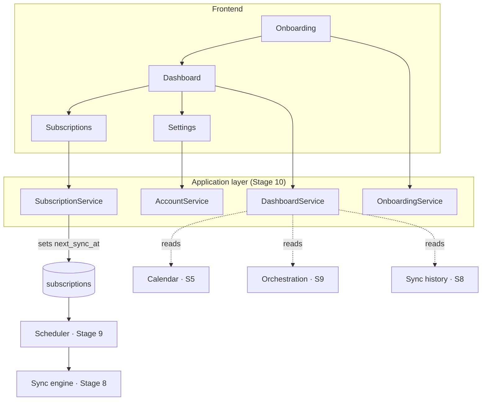

# Application Layer (Stage 10)

The stage that turns nine backend platforms into one product. It adds **no new
platform** — it composes the existing services into a user experience.

## What was added (and what wasn't)

| Added | Reused unchanged |
|---|---|
| Subscription CRUD (`/subscriptions`) | Sync engine, planner, diff (Stage 8) |
| Dashboard aggregation (`/dashboard`) | Orchestration, workers, locks (Stage 9) |
| Onboarding state (`/onboarding/status`) | Calendar Platform (Stage 5) |
| Profile + preferences (`/me`, `/me/preferences`) | Sports Platform (Stage 6) |
| Frontend: onboarding, dashboard, subscriptions, settings | Fixture ingestion (Stage 7) |
| Toast/card UI, product navigation | Auth (Stage 4) |

The subscription service does **not** synchronize. Creating a subscription sets
`next_sync_at`, and the existing scheduler enqueues it; "sync now" is the
existing `POST /jobs/sync`. Pause/resume flip `status`, which the engine and
scheduler already honour.



## User journey

```
First visit → Sign in with Google → Grant calendar access → Choose a calendar
   → Pick a sport → Select competitions → Finish → Dashboard → (ongoing)
```

Every step is **server-computed** (`/onboarding/status`), derived from what the
user has actually done — a linked account, granted scopes, a chosen calendar, a
subscription, a first sync. Closing the tab mid-flow and returning resumes at the
right step automatically; there is no stored cursor to drift.

Onboarding is "complete" once a calendar is selected **and** one subscription
exists. The dashboard redirects incomplete users into onboarding, and onboarding
redirects complete users into the dashboard.

## Subscription lifecycle

| Action | Effect | Reuses |
|---|---|---|
| Create | Insert row, `status=ACTIVE`, `next_sync_at=now` | resolves provider ids → catalog UUIDs via existing repos |
| Pause | `status=PAUSED` | engine + scheduler already skip PAUSED |
| Resume | `status=ACTIVE`, `next_sync_at=now` | scheduler catches up |
| Edit | `sync_frequency_minutes`, `event_prefix` | — |
| Delete | soft delete | next sync run prunes its calendar events |
| Bulk | best-effort; duplicates skipped | — |

The create request speaks the **same identifiers the browse endpoints return**
(sport key + provider external ids); the service resolves them to the internal
catalog UUIDs the FKs require. No new catalog endpoints were needed.

> **A bug worth noting:** the frozen `UNIQUE(user, calendar, scope, competition,
> team)` constraint does **not** fire when `competition_id`/`team_id` are NULL —
> SQL treats NULLs as distinct. So duplicate prevention is done with an explicit
> pre-insert check in the service, backed by the constraint. Caught by a test.

## Frontend architecture

```
app/(dashboard)/
├── layout.tsx        # auth guard + product nav (active states, mobile)
├── onboarding/       # guided wizard
├── dashboard/        # composed home screen
├── subscriptions/    # manage subscriptions
├── settings/         # profile, Google, notifications, danger zone
├── fixtures/         # (Stage 7) browse + import
├── sync/             # (Stage 8) sync center
└── jobs/             # (Stage 9) orchestration dashboard
lib/app/              # api.ts + use-app.ts (subscriptions, dashboard, …)
components/ui/        # Button, Card, Badge, Toaster (shadcn-consistent)
stores/toast-store.ts # ephemeral toast state (Zustand)
```

**State management** (Stage 1's hard rule, upheld):
- **Server state → TanStack Query.** Every list, the dashboard, onboarding,
  preferences. Mutations invalidate the affected keys; the dashboard also polls.
- **Client/UI state → Zustand.** Toasts and the onboarding wizard selection only.
  Never a copy of server data.

**Error handling:** an `ApiError` envelope from the shared client, route-segment
error boundaries (`(dashboard)/error.tsx`), a global boundary
(`global-error.tsx`), a `needs_reauth` banner on the dashboard, and toasts for
mutation feedback. The API client already transparently refreshes a 401 once.

**Accessibility:** semantic landmarks (`<header>`, `<nav aria-label>`, `<main>`),
`aria-current` on the active nav item, an `aria-live` toast region, labelled form
controls and icon buttons, visible focus rings (shadcn default), and keyboard-
operable controls throughout. Dark mode is a CSS-variable swap (Stage 2).

**Performance:** App Router code-splits each route; queries cache with per-view
`staleTime`; the dashboard is a single aggregation call rather than a fan-out of
requests from the browser; lists are paginated server-side.

## API (added this stage)

| Method | Path | Purpose |
|---|---|---|
| GET/POST | `/api/v1/subscriptions` | list / create |
| POST | `/api/v1/subscriptions/bulk` | subscribe to many |
| POST | `/api/v1/subscriptions/bulk-delete` | unsubscribe from many |
| GET/PATCH/DELETE | `/api/v1/subscriptions/{id}` | get / edit / delete |
| POST | `/api/v1/subscriptions/{id}/pause` · `/resume` | pause / resume |
| PATCH | `/api/v1/me` | update profile |
| GET/PUT | `/api/v1/me/preferences` | notification + display prefs |
| GET | `/api/v1/onboarding/status` | computed onboarding state |
| GET | `/api/v1/dashboard` | aggregated home screen |

Everything else — auth, calendars, sports, fixtures, sync, jobs — is the API
built in earlier stages, unchanged.

## Notifications

**Configuration only.** The settings page stores per-channel toggles and targets
(email, browser, Discord, Slack) and reminder timing in `user_preferences`.
Delivery is a future stage; nothing here sends anything.

## Schema

One additive migration, `0003_user_preferences` — a single table for durable
user configuration that had no home in the frozen schema. Justified exactly like
Stage 7's migration: durable truth belongs in Postgres, not a cache (Stage 1).
No existing table changed.

## User guide

1. **Sign in** with Google at `/login`.
2. **Onboarding** walks you through granting calendar access, picking a calendar,
   and choosing competitions to follow.
3. Your **Dashboard** shows subscriptions, sync status, and system health, with a
   **Sync now** button.
4. **Subscriptions** — pause, resume, change frequency, or remove any.
5. **Fixtures** — browse everything ingested; **Sync** — see plans and history.
6. **Settings** — profile, reconnect Google, notification preferences, sign out.

## Developer guide

```bash
docker compose up --build          # full stack
cd backend && alembic upgrade head # includes 0003
cd backend && pytest tests/ -k application
cd frontend && npm run test        # toast store + card
```

The application services live in `app/application/services/` (subscription,
dashboard, onboarding, account) and are pure composition over existing
repositories and platform services. To add a user-facing feature, compose — do
not reimplement a platform.

## Troubleshooting

- **Stuck on onboarding** — a step is genuinely incomplete. `/onboarding/status`
  shows which. Usually: calendar not selected, or metadata not refreshed so no
  competitions appear.
- **"That competition is not in the catalog yet"** — run a metadata refresh
  (`POST /metadata/refresh`); subscriptions reference persisted catalog rows.
- **Dashboard shows workers 0 / scheduler down** — start a Celery worker and Beat
  (Stage 9). Manual sync still works; scheduled sync won't.
- **A removed subscription's events linger** — they clear on its next sync run
  (the engine prunes events for fixtures no longer covered).
