# Fixture Ingestion Platform (Stage 7)

A production ETL pipeline that turns normalized `Fixture` models from the Sports
Platform into persisted, versioned, deduplicated database rows. Stage 8's
synchronization engine consumes **only these rows**, never an external API.

## Pipeline

```mermaid
flowchart LR
    P[Sports Provider] --> SP[Sports Platform]
    SP -->|normalized Fixture| F[Fetch]
    F --> V[Validate]
    V --> N[Verify normalization]
    N --> D[Dedupe within payload]
    D --> R[Resolve competition + teams]
    R --> M[Match against stored fixtures]
    M --> VD[Detect version]
    VD --> B[Bulk persist + version rows]
    B --> A[Absence handling]
    A --> RP[Import report]
    RP --> DB[(Database)]
    DB -.Stage 8.-> SE[Synchronization Engine]
```



| Step | What it does | On failure |
|---|---|---|
| **Fetch** | `sports_service.get_fixtures(sport, competition, window)` | Competition marked failed; other competitions continue |
| **Validate** | Required fields, participants, plausible dates | Record rejected, counted `invalid`, run becomes `partial` |
| **Verify normalization** | Times aware-UTC, statuses the shared enum | Record rejected with a distinct code — this is *our* bug |
| **Dedupe** | Collapses repeats inside one payload | Reported as `duplicate_in_payload` warnings |
| **Resolve** | Competition + team UUIDs (one bulk round-trip) | Unknown team → `NULL` ref, not a rejection |
| **Match** | Three-rung ladder against stored fixtures | — |
| **Version** | Diff + classify + append `fixture_versions` row | — |
| **Persist** | Chunked bulk INSERT/UPDATE inside savepoints | Per-row fallback; conflicts absorbed as duplicates |
| **Absence** | Two consecutive absences → soft delete | — |
| **Report** | Counters + issues → `import_runs` row | Always written, even on total failure |

Each competition **commits independently**, so a failure late in a run never
discards work already done.

## Fixture identity

Three identifiers, each with a distinct job:

| Identifier | Meaning | Strength |
|---|---|---|
| `provider_fixture_id` | The vendor's own id, unique within a competition | Strongest, but not portable and occasionally reissued |
| `identity_key` (**UNIQUE**) | `hash(sport, competition, sorted(participants), kickoff day)` | Provider-independent fingerprint of *which real match* |
| `content_hash` | Digest of the mutable fields | Answers "did anything change" in O(1) |

**How identity survives provider updates.** The matcher tries provider id → identity
key → participants+time window:

- Kickoff moves within the day → identity key unchanged → matched.
- Kickoff moves **across midnight** → identity key changes, but the **provider id
  still matches** → the row is updated (and its identity key rewritten).
- Provider **reissues its id** → the **identity key still matches**.
- Both happen at once → the fuzzy rung (exact participant set, ±12 h) catches it.

The two keys fail independently, which is why one always survives.

> **Consequence worth knowing:** identity is day-bucketed, so two records with the
> same teams in the same competition on the same day **are the same match**,
> whatever their kickoff times or provider ids. A provider listing a fixture twice
> is collapsed. A team genuinely playing the same opponent twice in one day is not
> representable — no real competition does this.

## Version tracking

Every persisted change appends an immutable `fixture_versions` row: `version`,
`change_type`, `changed_fields`, `content_hash`, and a JSON `snapshot`.

Detected fields: `scheduled_start`, `scheduled_end`, `status`, `venue`,
`competition`, `participants`, `round`, `stage`.

Change types are **derived from the status transition**:

| Transition | Type |
|---|---|
| `LIVE → CANCELLED` | `abandoned` (stopped mid-play) |
| `* → CANCELLED` | `cancelled` |
| `* → POSTPONED` | `postponed` |
| `CANCELLED/POSTPONED/DELETED → SCHEDULED/LIVE` | `restored` |
| second consecutive absence | `deleted` |
| anything else changed | `updated` |

> No provider reports "abandoned" and the frozen `FixtureStatus` enum has no such
> member — hence it is a *change type*, not a status. This avoided altering a
> frozen enum.

Fixtures are **soft-deleted**, never destroyed. History is append-only.

## Deduplication

`app/domain/fixtures/deduplication.py` — pure, ORM-free, **reusable by Stage 8**.

- `dedupe_batch(items)` — collapses duplicates inside one provider payload.
- `FixtureMatcher.match(candidate, index)` — matches against stored fixtures.

Only the third rung is heuristic, and it requires an **exact participant-set
match**, so it can never merge two different matches; the ±12 h tolerance only
forgives rescheduling.

### The concurrency guarantee

Application logic alone cannot win a race. Two imports can both read an empty
index and both attempt an INSERT. The **UNIQUE `identity_key`** rejects the loser,
whose row is absorbed as a `concurrent_insert_conflict` warning via a per-row
savepoint fallback. Duplicates are therefore impossible, not merely unlikely.

## Import policies

| Situation | Policy |
|---|---|
| **Past fixtures** | Imported within `FIXTURE_IMPORT_PAST_DAYS` (default 7); older are `skipped_out_of_window` |
| **Future fixtures** | Imported within `FIXTURE_IMPORT_FUTURE_DAYS` (default 120) |
| **Duplicate imports** | Content hash matches → `unchanged`, zero writes. Fully idempotent |
| **Provider regressions** | Incoming `provider_updated_at` older than stored → `skipped_stale` |
| **Missing fields** | Rejected by validation (`invalid`); the rest of the batch imports |
| **Implausible dates** | Rejected (a 1800 kickoff is a regression, not a fixture) |
| **Deleted fixtures** | **Two** consecutive absences before soft delete — one flaky read must never destroy data |
| **Late updates** | A reappearing fixture is `restored`, not duplicated |
| **Unknown team** | Stored as `NULL` team ref with the fixture kept; run a metadata refresh |
| **>2 participants** | Team refs omitted + warning; needs a participants table, not a hack |

## Partial failure recovery

- **Record level** — one invalid fixture is rejected; the other 999 import.
- **Competition level** — a provider outage fails one competition; others proceed.
- **Run level** — the `import_runs` row is always written, even on total failure.
- **Transaction level** — per-competition commits, per-row savepoint fallback.
- **Retry queue / dead letter** — *logical only in this stage*: failures are
  aggregated into the report with stable `code`s. Stage 8's Celery workers will
  own real retry and dead-letter mechanics.

Statuses: `success` (clean), `partial` (some records or competitions failed),
`failed` (every competition failed).

## Performance

- **Bulk INSERT/UPDATE** via `session.execute(insert(Fixture), rows)` executemany,
  chunked at `FIXTURE_IMPORT_BATCH_SIZE` (default 500) to bound memory.
- **One round-trip** to resolve all participant teams (`map_provider_ids`).
- **O(1) matching** via hash indexes built once per competition.
- **Content-hash short-circuit** — an unchanged fixture costs zero writes.
- **Per-competition streaming** — the whole provider catalog is never held at once.
- Version rows are bulk-inserted alongside.

## Schema changes (migration `0002`)

Additive only; migration `0001` untouched.

| Addition | Why nothing existing worked |
|---|---|
| `fixtures.version` | No counter existed |
| `fixtures.missing_since` | The stability threshold needs to remember the first absence |
| `fixture_versions` | `sync_history`/`sync_operations` are subscription-scoped (Stage 8) |
| `import_runs` | Reports are durable audit truth; Redis is a cache, never a system of record |

The migration backfills a `version 1` row for every pre-existing fixture.

```bash
cd backend && alembic upgrade head
```

## API

| Method | Path | Description |
|---|---|---|
| POST | `/api/v1/fixtures/import` | Import one sport (optionally scoped to competitions) |
| POST | `/api/v1/fixtures/import/provider` | Import every sport of one provider |
| GET | `/api/v1/fixtures/import/status` | Recent import runs |
| GET | `/api/v1/fixtures/import/report/{id}` | Full report for one run |
| GET | `/api/v1/fixtures` | Browse (filter by sport/status/date, search, paginate) |
| GET | `/api/v1/fixtures/{id}` | One fixture + its full version history |

All require authentication. **No synchronization endpoints exist.**

## Observability

Logged: `fixtures.import.started` / `.finished` (with every counter),
`.competition`, `.fetch_failed`, `.invalid_record` (codes only).
**Provider payloads are never logged** — only counts, codes, and ids.

## Developer guide

```bash
cd backend
alembic upgrade head
python scripts/seed.py                       # sports + competitions
# refresh metadata first: teams must exist before fixtures reference them
curl -X POST localhost:8000/api/v1/metadata/refresh
curl -X POST localhost:8000/api/v1/fixtures/import -d '{"sport":"football"}'
pytest tests/ -k fixture                     # the ingestion test suite
```

Browse at `http://localhost:3000/fixtures`.

## Troubleshooting

- **`sport_not_in_catalog`** — run `POST /metadata/refresh` first; ingestion reads
  the persisted catalog, it does not fetch competition lists.
- **Fixtures import but teams are `null`** — the team is not in the catalog yet.
  Refresh metadata; the next import backfills the ref (a versioned `participants`
  change).
- **Everything `skipped_out_of_window`** — the fixtures fall outside the past/future
  windows. Widen with `past_days` / `future_days` on the import request.
- **`skipped_stale`** — the provider sent an older revision than the one stored.
  This is the regression guard working.
- **A fixture vanished** — it was absent twice, so it was soft-deleted
  (`status=deleted`, `deleted_at` set). It is still in the table, and reappearing
  will `restore` it.
