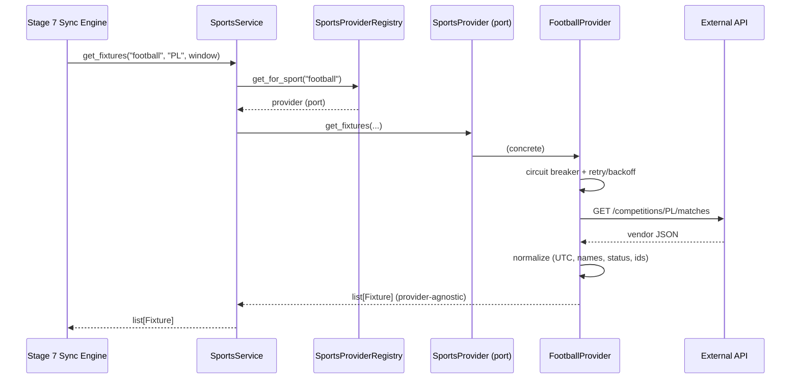

# Sports Integration Platform (Stage 6)

MatchSync's "Sports SDK". Any service can discover sports, competitions, teams,
and fixtures without knowing which vendor or API supplied them.

```python
await sports_service.list_sports()
await sports_service.list_competitions("football")
await sports_service.list_teams("football", "PL")
await sports_service.get_fixtures("football", "PL", window)   # Stage 7 consumes this
await sports_service.search("arsenal")
await sports_service.refresh_metadata()
```

## Architecture

Deliberately the same shape as the Stage 5 Calendar Platform.

```
Application      SportsService  ·  MetadataService
                        │  depends on the port only
Domain (ports)   SportsProvider  +  Sport/Competition/Team/Fixture/…
                 sports/normalization.py  ·  sports/codec.py
                        ▲  implemented by
Infrastructure   FootballProvider   ValorantProvider   BasketballProvider
                        └──────── BaseHttpSportsProvider ────────┘
                                   │            │           │
                        ResilientHttpClient  CircuitBreaker  Cache
                             (reused from Stage 5)
                 SportsProviderRegistry (registration · lookup · plugins)
```

**No vendor vocabulary escapes `infrastructure/providers/`.** The sync engine
consumes only the frozen dataclasses in `domain/ports/sports_provider.py`.



## Adding a new provider (e.g. Formula 1)

Exactly two steps — nothing else changes:

1. Implement `SportsProvider` in `app/infrastructure/providers/formula1/`.
2. `registry.register(Formula1Provider(config, http, breaker))`.

No service change, no schema change, no engine change. Third-party plugins can
register via the `matchsync.sports_providers` entry-point group without living
in this repo.

## Capability system

Not every vendor supports everything. Providers **advertise** what they can do;
callers check before asking, so nothing raises from a half-implemented method.

| Capability | Football | Valorant | Basketball |
|---|:--:|:--:|:--:|
| `live_scores` | ✅ | ✅ | ✅ |
| `standings` | ✅ | — | — |
| `venues` | ✅ | — | — |
| `seasons` | ✅ | — | — |
| `team_logos` | ✅ | ✅ | — |
| `tournaments` | — | ✅ | — |
| `brackets` | — | ✅ | — |
| `statistics` | — | — | ✅ |

Asking for an unsupported capability raises `CapabilityNotSupportedError`
**before any network call**.

## Normalization rules

The guarantee: three vendors with three payload shapes emit *structurally
identical* models. Every rule and its rationale lives in
`app/domain/sports/normalization.py`. Summary:

| Concern | Rule |
|---|---|
| **Times** | Always timezone-aware **UTC**. Naive input is assumed UTC, never server-local (the classic off-by-hours bug). Accepts RFC3339, offsets, naive strings, epoch seconds. |
| **Names** | NFKC fold, strip zero-width chars, canonicalize dashes, collapse whitespace. Club suffixes ("FC") are **kept** — stripping them is lossy and collides distinct clubs. |
| **Slugs** | ASCII, lowercase, derived from the normalized name. |
| **Statuses** | Mapped into the shared `FixtureStatus`. Unknown values fall back to `SCHEDULED` — a new vendor status must never drop a fixture. |
| **Ids** | Coerced to trimmed strings; kept **native** (Stage 3's frozen columns store them). `qualified_id()` adds a provider prefix when global uniqueness is needed. |
| **Seasons** | Canonical labels: `"2026"` or `"2025/26"`. Derived from dates when the vendor gives none. |
| **Countries/Venues** | Trimmed; empty becomes `None` so "absent" is unambiguous. |
| **Partial failure** | One malformed record is skipped and logged; the batch survives. |

### How the three providers differ (and why you can't tell)

- **Football** — richest vendor. Uses the stable code (`"PL"`) as the external
  id because every other endpoint accepts it as a path parameter.
- **Basketball** — has **no competitions endpoint** and no standings. The adapter
  *synthesizes* an "NBA" competition and simply omits `standings` from its
  capabilities. Maps `visitor_team` → `away`.
- **Valorant** — esports: no home/away and no venues. Participants are emitted
  with `ParticipantSide.NEUTRAL` and `venue=None`. Same `Fixture` model.

> ⚠️ The three adapters are written against each vendor's **documented** response
> shapes and are covered by mocked tests. They have **not** been validated
> against live APIs. Verify before production use.

## Resilience

- **Retries** — reuses Stage 5's `ResilientHttpClient` (exponential backoff, full
  jitter, `Retry-After`). Per-provider `RetryPolicy` and connection pool.
- **Circuit breaker** — one per provider. Retries handle a blip; the breaker
  handles a sustained outage by failing fast. A dead football API never trips
  basketball.
- **Rate limits** — `429` retried; exhaustion surfaces `RateLimitError`.
- **Auth** — `401/403` → `ProviderAuthenticationError` (**502**, not 401: it is
  *our* misconfiguration, not the end user's).
- **Compression** — `Accept-Encoding: gzip` on every request.
- **Pagination** — hidden inside each adapter (page tokens, cursors).

### Error mapping

| Upstream | Application exception | HTTP |
|---|---|---|
| 401 / 403 | `ProviderAuthenticationError` | 502 |
| 404 | `SportsProviderError` | 502 |
| 429 | `RateLimitError` (retried) | 429 |
| 5xx / network / circuit open | `ProviderUnavailableError` | 503 |
| Non-JSON body | `MalformedResponseError` | 502 |
| Missing/unmappable field | `NormalizationError` (per record, skipped) | 502 |
| Unsupported capability | `CapabilityNotSupportedError` | 400 |

## Caching

Read-through, Redis-backed (`InMemoryCache` in tests).

- **What:** metadata only — sports, competitions, teams. **Fixtures are never
  cached** (volatile; Stage 7 owns them).
- **TTL:** per-provider (`ProviderConfig.cache_ttl_seconds`, default 1 h).
  Reference data changes rarely; provider quotas do not forgive.
- **Invalidation:** `refresh_metadata()` clears the provider's namespace via
  `delete_prefix`, so refreshed data is immediately visible.
- **Cold start:** a miss simply calls the provider and repopulates. No herd lock
  is needed — metadata reads are rare and idempotent.

## Metadata refresh

`POST /api/v1/metadata/refresh` upserts sports, competitions, teams, logos, and
the `provider_metadata` health row through the **existing Stage 3 repositories**.
It **does not fetch fixtures**.

Partial-failure semantics: each provider refreshes independently; a dead vendor
is marked `DOWN` and reported, but never aborts the others. Within a provider, a
competition whose teams fail is recorded in `errors[]` and the refresh continues.

## API

| Method | Path | Description |
|---|---|---|
| GET | `/api/v1/sports` | Sports served by registered providers. |
| GET | `/api/v1/competitions?sport=` | Competitions for a sport. |
| GET | `/api/v1/teams?sport=&competition=` | Teams in a competition. |
| GET | `/api/v1/providers` | Registered providers + configuration state. |
| GET | `/api/v1/capabilities` | Capability matrix. |
| GET | `/api/v1/search?q=` | Provider-independent catalog search. |
| POST | `/api/v1/metadata/refresh` | Refresh reference data (no fixtures). |

All require authentication. **No fixture or synchronization endpoints exist.**

## Search

Searches the **locally-persisted catalog**, not the providers: results are
instant, quota-free, and identical regardless of which vendor supplied the
record. Run a metadata refresh first, or search returns nothing.

## Configuration

```bash
FOOTBALL_API_BASE_URL=https://api.football-data.org/v4
FOOTBALL_API_KEY=...
VALORANT_API_BASE_URL=https://vlrggapi.vercel.app
VALORANT_API_KEY=...
BASKETBALL_API_BASE_URL=https://api.balldontlie.io/v1
BASKETBALL_API_KEY=...
SPORTS_CACHE_TTL_SECONDS=3600
```

A provider with a blank key is still **registered** but reports
`configured: false` and refuses network calls — visible in the Sports page.

## Developer guide

```bash
cd backend && pytest tests/ -k sports     # the sports test suite
# Browse: http://localhost:3000/sports
```

Logs: `sports.provider.call` (provider, path, status, latency — never params or
bodies), `sports.cache.hit`/`miss`, `sports.normalization.failed`/`partial`,
`sports.metadata.refreshed`, `provider.breaker.open`. **API keys, secrets, and
payload bodies are never logged.**

## Troubleshooting

- **`sports_provider_auth_failed`** — the provider's API key is missing or
  invalid. Check `/api/v1/providers` for `configured: false`.
- **`provider_unavailable` immediately, no network call** — the circuit breaker
  is open. It half-opens after 30 s.
- **Search returns nothing** — run `POST /metadata/refresh` first; search reads
  the database, not the providers.
- **`capability_not_supported`** — the vendor genuinely lacks that feature (e.g.
  basketball standings). Check `/api/v1/capabilities`.
- **Fixtures missing after a vendor status change** — unknown statuses map to
  `SCHEDULED` by design; check `sports.normalization.partial` logs for skips.
